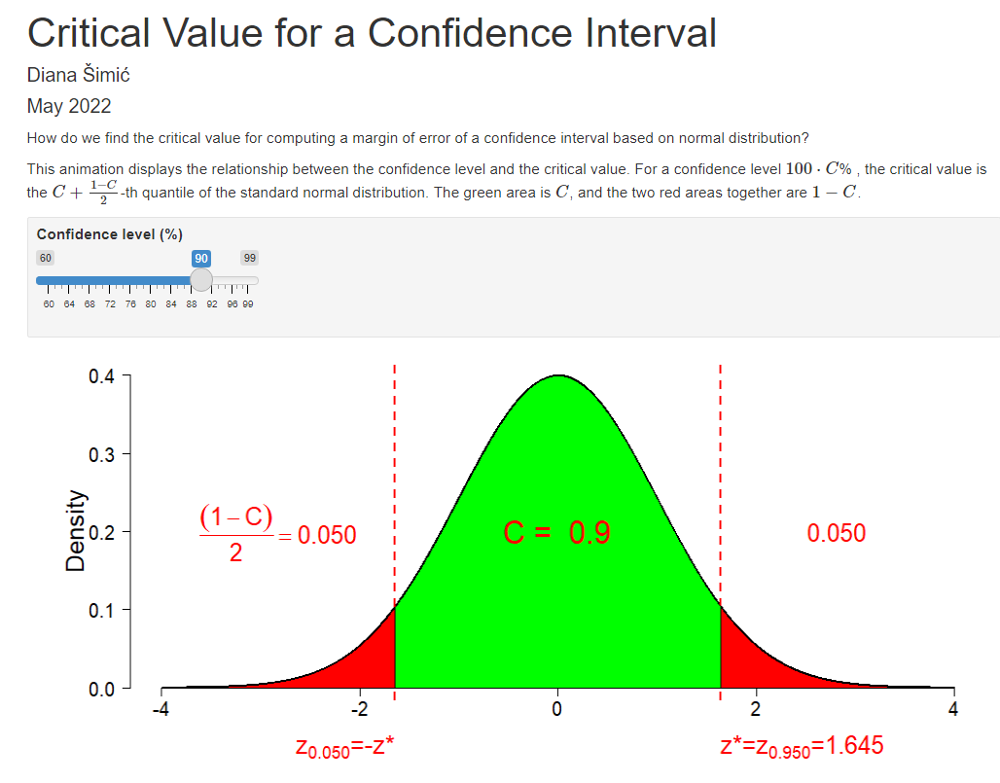
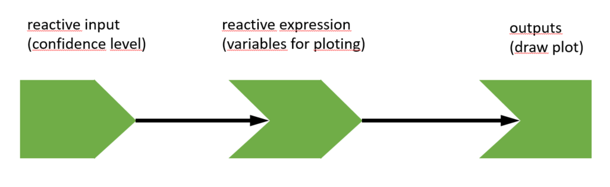
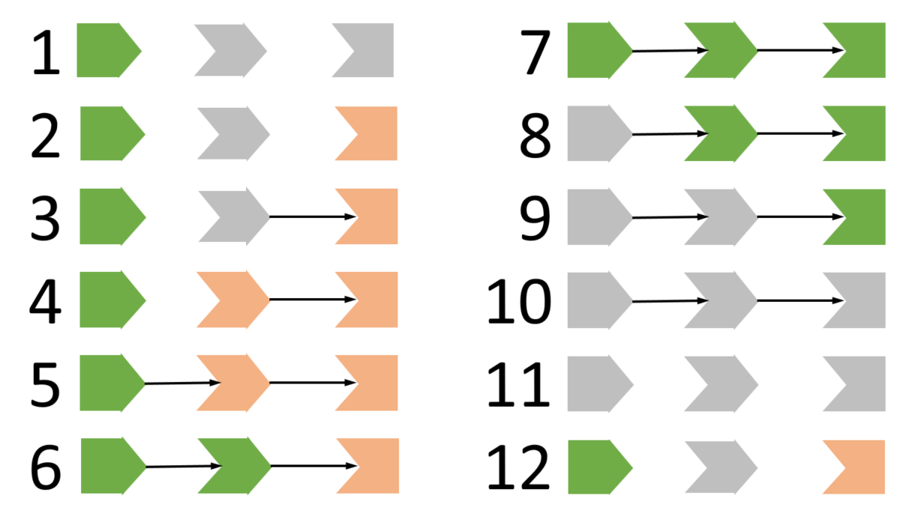

<style type="text/css">
h3 {
  text-align: center;
  position: fixed;
  top: 50%;
  left: 50%;
  transform: translate(-50%, -50%);
  font-size: 2em;
}
}
</style>

```{r setup, include=FALSE}
knitr::opts_chunk$set(echo = FALSE)
library(pander)
```

## What do you expect from the lecture / workshop?

menti.com 74 64 78 3
{width=30%}

## Course materials


https://github.com/disimic/Shiny-for-Teaching-Statistics


# Let's see some examples

## Critical value for the confidence interval {.build}

- Open the https://github.com/disimic/Shiny-for-Teaching-Statistics
- Click on *Links.md*
- Click on *Critical value for a confidence interval*

or 

- Open RStudio
- Open document *ConfidenceIntervalCriticalValue_en.Rmd*
- Click on "Run Document"

## Let's play with menti

Open menti.com and answer the question

menti.com 74 64 78 3
{width=30%}

## More examples {.build}

ConfidenceIntervalProportion_en.Rmd  

GuessTheCorrelation_en.Rmd

# R, RStudio, Rmarkdown and Shiny

## R

> - Programming language and environment for statistical computing
> - Along with Python the language most used for data science, statistics and data analytics
> - Open source and free (as a bird and without cost) http://www.r-project.org
> - Flexible - extendable with packages (more than 18500 packages)  

## Some R history

> - Robert Gentleman and Ross Ithaka, University of Auckland, Statistics Department
> - Project started in 1992, beta version 1995, stable version 2000
> - Syntax inspired by (and largely compatible with) the S Systems developed in Bell Laboratories by the team led by Dr. John M. Chambers in 1976
> - 1998: John M. Chambers --- the ACM Software Systems Award for "... the S system, which has forever altered how people analyze, visualize, and manipulate data".
> - 2008: Robert Gentleman --- Benjamin Franklin Award for Open Access in Life Sciences "in recognition of his work on R programming language and the Bioconductor project, as well as his commitment to sharing data and methods".
> - 2008: Ross Ithaka --- Pickering Medal of the Royal Society of New Zealand for excellence and innovation in practical applications of technology.

## RStudio

> - Integrated development environment
> - Editor (syntax highlight, automatic ending)
> - Data management (data inport, environment overview, files)
> - Output management (graphics, export)
> - Console
> - Help system, etc.

## RStudio people - Hadley Wickham

> - Chief Scientist at RStudio, author of many R packages (tidyverse, ggplot) and books
> - 2019: COPSS Presidents' Award in for "for influential work in statistical computing, visualization, graphics, and data analysis; for developing and implementing an impressively comprehensive computational infrastructure for data analysis through R software; for making statistical thinking and computing accessible to large audience; and for enhancing an appreciation for the important role of statistics among data scientists".

## RStudio people - Mine Çetinkaya-Rundel

> - Educator and data scientist at RStudio
> - Professor and Director of Undergraduate Studies at the Department of Statistical Science at Duke University
> - Senior lecturer at the School of Mathematics, University of Edinburgh
> - Research interests: innovation in statistics and data science pedagogy, with an emphasis on computing, reproducible research, student-centered learning, and open-source education as well as pedagogical approaches for enhancing retention of women and under-represented minorities in STEM
> - https://www.openintro.org/book/os/
> - https://mine-cr.com/
    
## Rmarkdown

> - R package for reproducible statistical computing
> - Reports formated using simple syntax
> - Based on the "literate programming" paradigm developed by Donald Knuth in 1984
> - Shift from "telling computer what to do" to "explaining to human beings what we want computer to do"
> - Create a single document integrating data analysis (code and results) with textual documentation

## Create an Rmarkdown document

- From the File menu select New File => R Markdown
- Type in a title and your name
- On the left choose Document
- For Default Output Format choose HTML
  - for PDF you need to have LaTeX installed
  - for Word you need to have MS Office or Libre Office installed
- Click OK
- In the window of the new script click "Knit"
  - when asked provide a file name Example-1.Rmd

## Learning Rmarkdown

https://rmarkdown.rstudio.com/lesson-1.html

https://bookdown.org/yihui/rmarkdown/

https://www.rstudio.com/resources/cheatsheets/


## Shiny

- R package introducing reactivity to R programming
- Dynamic reports, dashboards, web applications
- In RStudio three types of Shiny apps
    + "Pure" Shiny app in two parts (ui.R, server.R, frontend and backend)
    + "Pure" Shiny app in one part (app.R - both frontend and backend in a single file)
    + Rmarkdown with Shiny at runtime
    
    
## Shiny app deployment

> - Run in the RStudio desktop: open and run an .R or .Rmd file from RStudio in an RStudio output window or the default browser
> - Publish on a Shiny or RStudio Connect server
    - Public server (https://www.shinyapps.io/)
    - Private server

## Parts of an Rmarkdown Shiny document {.flexbox .vcenter}

<div class="columns-2">
{width=100%}

- Title and static text and images (does not change)
- Input (can be changed dinamically)
- Output (depends on/changes with the Input)
</div>


## A simple Shiny app using Rmarkdown

- From the File menu select New File => R Markdown
- Type in a title and your name
- On the left choose Shiny
- For Default Output Format choose Shiny Document
- Click OK
- In the window of the new script click "Run Document"
  - when asked provide a file name Example-2.Rmd


## Parts of an R Markdown Shiny document  

- YAML header
- text (formatted using markdown)
- R code chunks (this is where the magic happens)

## YAML header

```
---
title: ""
author: ""
date: ''
output: html_document
runtime: shiny
---
```

Just fill in title, author, and date, and don't touch anything else :-)

## R Markdown text

```{r}
pom <- data.frame(Function = c("Section headers:", "Paragraph:",
                               "Bulleted list:",
                               "Nested lists:",
                               "Numbered list:",
                               "Italics:",
                               "Bold:"),
                  Format=c("#, ##, ### at the beginning of a line ",
                           "two spaces at the end of a line",
                           "start a new line with a - or * or +",
                           "indent the list",
                           "start a new line with number 1. etc.",
                           "put text between characters *",
                           "put text between characters **"))
pander(pom)
```

## R Code chunks

- Code chunks start with ` ```{r} `, and end with ` ``` `  
- Options can be added within the braces
- Code in a chunk is run, and the output is included in the document

For example chunk:

` ```{r echo=TRUE} `  
` 2+2 `  
` ``` `  

will result in:

```{r echo=TRUE}
2+2
```

## Shiny means reactive

> - Shiny package makes an R Markdown document reactive
> - `inputPanel()` is used to get input from a reader. Arguments are comma separated input controls
> -  `render*()` is used to create output that is automatically changed when input changes. `*` can be Text, Plot, Image, Table etc. for different types of output


## Shiny input functions 1/3{.smaller}

```{r echo =TRUE, results='hide'}
checkboxInput("Flag", "Is it blue?", value=FALSE)
renderText(paste("And the result is:", input$Flag))
```

```{r}
checkboxInput("Flag", "Is it blue?", value=FALSE)
renderText(paste("And the result is:", input$Flag))
```

<br>

```{r echo = TRUE, results='hide'}
selectInput("Select", "Select:", choices=c("A", "B", "C"),
            selected = "A", multiple = FALSE)
renderText(paste("And the result is:", input$Select))
```

```{r}
selectInput("Select", "Select:", choices=c("A", "B", "C"),
            selected = "A", multiple = FALSE)
renderText(paste("And the result is:", input$Select))
```


## Shiny input functions 2/3{.smaller}

```{r echo =TRUE, results='hide'}
radioButtons("rad.id", "Select:", choices=c("A", "B", "C"), selected = "A", inline=FALSE)
renderText(paste("And the result is:", input$rad.id))
```

```{r}
radioButtons("rad.id", "Select:", choices=c("A", "B", "C"), selected = "A", inline=FALSE)
renderText(paste("And the result is:", input$rad.id))
```

<br>

```{r echo =TRUE, results='hide'}
numericInput("Number", "How long is it?", min = 1, max = 100, step = 1, value = 10)
renderText(paste("And the result is:", input$Number))
```

```{r}
numericInput("Number", "How long is it?", min = 1, max = 100, step = 1, value = 10)
renderText(paste("And the result is:", input$Number))
```

## Shiny input functions 3/3{.smaller}

```{r echo =TRUE, results='hide'}
sliderInput("Slide1", "How much?", min=1, max=10, step=0.1, value=5)
renderText(paste("And the result is:", input$Slide1))
```

```{r}
sliderInput("Slide1", "How much?", min=1, max=10, step=0.1, value=5)
renderText(paste("And the result is:", input$Slide1))
```

<br>

```{r echo =TRUE, results='hide'}
sliderInput("Slide2", "How much?", min=1, max=10, step=0.1, value=c(1,3))
renderText(paste("And the result is:", paste(input$Slide2, collapse = " to ")))
```

```{r}
sliderInput("Slide2", "How much?", min=1, max=10, step=0.1, value=c(1,3))
renderText(paste("And the result is:", paste(input$Slide2, collapse = " to ")))
```

## Back to playing ...

menti.com  74 64 78 3
{width=30%}

## Shiny render functions 1/3{.smaller}

```{r echo=TRUE, results='hide'}
sliderInput("Slide3", "N", min=30, max=1000, step=1, value=100)
renderText(paste("N = ", input$Slide3))
```

```{r}
sliderInput("Slide3", "N", min=30, max=1000, step=1, value=100)
renderText(paste("N = ", input$Slide3))
```

<br>

```{r echo=TRUE, results='hide'}
sliderInput("Slide4", "N", min=30, max=1000, step=1, value=100)
renderPrint(paste("N = ", input$Slide4))
```

```{r}
sliderInput("Slide4", "N", min=30, max=1000, step=1, value=100)
renderPrint(paste("N = ", input$Slide4))
```


## Shiny render functions 2/3{.smaller}

<div class="columns-2">

```{r echo=TRUE, results='hide'}
sliderInput("Slide5", "N", 
            min=30, max=1000, 
            step=1, value=100)
renderPlot({
  x <- rnorm(input$Slide5)
  hist(x)}, 
  width = 500, 
  height = 300)
```

<br>
<br>
<br>
<br>
<br>
<br>
<br>

```{r}
sliderInput("Slide5", "N", min=30, max=1000, step=1, value=100)
renderPlot({x <- rnorm(input$Slide5)
hist(x)}, width = 500, height = 300)
```

</div>


## Shiny render functions 3/3

- renderTable()
- renderDataTable()
- renderImage()


## Back to playing ...

menti.com  74 64 78 3
{width=30%}


## Reactivity graph {.flexbox .vcenter}

{width=80%}

- Shows dependence between reactive code parts
- When a reactive object changes value, code parts that depend on it become invalidated (need to be executed again)


## Sequencing {.flexbox .vcenter}

{width=90%}


## Let's get working

- Open the github.com/disimic/biostat2021
- Click on Links.md
- Click on Activity - Create your first Shiny document
- Try to create a Shiny document that looks and reacts exactly like Example 2


## Adding more structure

- This is just a one page document.
- More structure can be added using the package flexdashboard
- Open the document "LinearRegression_en.Rmd"

## The header

```
---
title: "Correlation and linear regression"
output: 
  flexdashboard::flex_dashboard:
    orientation: columns
    vertical_layout: fill
runtime: shiny
---
```

Before, we had a simple line  
```
output: html_document
```

## Dashboard structure

- With flexdashboard we can add structure
- the first level headers introduce tabs ( with one # or double underscores)
- the second level headers introduce columns ( with two ## or single underscore)
- the third level headers introduce titles within columns, i.e. rows

Special second order header:
```
Input {.sidebar}
----------------
```
creates the left column with slightly different format.

## Flexdashboard options

With options in the YAML header we can change the layout of a dashboard  
- orientation can be columns or rows  
- vertical_layout can be fill or scroll  

We can add options after column (row) headings  
- {data-orientation=columns | rows}  
- {data-width=}  
- {data-height=}  

## And now to your ideas

Assignment: 

- develop  an idea for a Shiny app that you would like to use in teaching your classes.
- think about what are inputs, and what are outputs of that Shiny app
- Open the github.com/disimic/biostat2021
- Click on Links.md
- Click on Activity - Add your ideas to a Google doc
- In the Google doc write your 
  - name or nick
  - short description of your Shiny idea
  - identify inputs and outputs

--------------------------

### Implement your idea!

---------------------

### Thank you!


